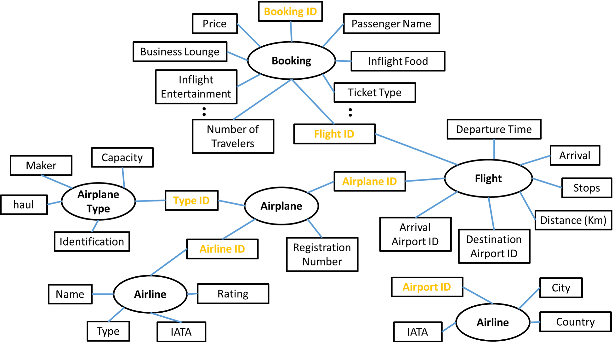

## Airline Bookings Dashboard using FlighHub Services

An interactive Streamlit dashboard for analyzing airline bookings and ratings.
This dashboard provides actionable insights for airlines and travel analysts by
visualizing KPIs, booking trends, and popular travel routes.

# Features
 - **Total Travelers:** Total number of booked passengers.
 - **Total Flights:** Total number of flights in the dataset.
 - **Preferred Destination:** The most popular destination based on bookings.
 - **Booking Growth:** Month-over-month growth in bookings.
 - **Top Routes:** Most frequent origin-destination pairs.
 - **Airline Ratings:** Ratings for airlines with sortable and filterable views.
 - **Interactive Filters:** Filter by month, airline, destination, or route.

# Screenshots - Dashboard overview

 KPIs & Top Routes:
 

 Monthly Bookings:
 

 Ticket Type Preference:
 

 Airline Ratings Table:
 

# Installation & Setup
 1. Download MySQL80 service:
      https://dev.mysql.com/downloads/installer/

 2. Clone the repository:
    git clone https://github.com/Alirockman1/airline_dashboard.git
    cd airline_dashboard

 3. Create `.env` file with Database credentials:
        DB_HOST=localhost
        DB_USER=root
        DB_PASSWORD=yourpassword
        DB_NAME=aviation_db

 4. Install dependencies:
    pip install -r requirements.txt

 5. Run the Streamlit app:
    streamlit run main.py

# Dependencies
 - Python 3.10+
 - Streamlit
 - pandas
 - matplotlib / plotly / altair (if used for charts)

# Code Overview
 - **app.py:** Main Streamlit app that displays the dashboard. Loads booking and airline data,
   calculates KPIs (total travelers, flights, preferred destination, booking growth),
   computes top routes, displays airline ratings, and adds interactive filters using
   Streamlit widgets (st.selectbox, st.multiselect, etc.). Layout structured with
   st.columns and st.expander for clean visualization.
 - src/: Contains helper scripts for data processing
    - **database.py:** Functions to load and query datasets
    - **merg.py:** Functions to merge booking and airline data
    - **utils.py:** Utility functions used across the dashboard
    - **wrangling.py:** Functions for cleaning and transforming data

# How to Use
 1. Use the sidebar to filter data by month, airline, or destination.
 2. Explore KPIs at a glance.
 3. Check the most popular routes and airlines.
 4. Analyze trends with charts and tables.

# Database Overview
 - Booking
   - Stores details of individual bookings made by passengers along with passenger profile information
   - Key columns: booking_id, airline_id, flight_id, booking_date, booking_count, passenger_age, passenger_name, gender, passenger_age, booking_status, flight_rating.
   - Usage: Analyze booking trends over time, calculate growth rates, segment customers by demographics.

 - Flight
   - Contains information about flights offered by the airline.
   - Key columns: flight_id, flight_number, departure_airport, arrival_airport, scheduled_departure, scheduled_arrival.
   - Usage: Track flight schedules, delays, and link bookings to specific flights.
 
 - Airline
   - Stores data about frequently traveled airlines.
   - Key columns: airline_id, IATA, name, international or domestic.
   - Usage: 

 - Airplane
   - Stores details about individual aircraft in the fleet.
   - Key columns: airplane_id, airplane_type_id, airline_id, manufacture_year, capacity, status.
   - Usage: Fleet management, aircraft utilization analysis, maintenance planning.

 - Airplane Type
   - Contains specifications of airplane models used across the fleet.
   - Key columns: airplane_type_id, manufacturer, model, range, seating_capacity, engine_type.
   - Usage: Standardize airplane classifications, support fleet composition analysis, optimize route assignments.

 - Airport
   - Contains metadata about airports.
   - Key columns: airport_code, airport_name, city, country.
   - Usage: Geographic analysis of flight routes, network optimization.

 - Passenger Feedback
   - Collects passenger reviews and service ratings.
   - Key columns: feedback_id, booking_id, flight_id, rating, comments, submission_date.
   - Usage: Assess customer satisfaction, identify service improvement areas, track airline/flight performance trends.

 Database:
 

# Questions Answered
 **Q: What age demographic should promotions target?**
 - Adults aged 30 to 65 years make up the largest share of passengers.
 - Offering premium packages (e.g., business lounge access, priority boarding) is projected to increase new customer acquisition in this group by ~33%.

 **Q: How airfare was effected by Covid?**
 - Domestic travel remained relatively resilient, showing a much smaller decline compared to international flights.
 - International bookings dropped sharply during 2020–2021, with recovery lagging by almost two years compared to domestic routes.
 - Post-COVID, domestic routes continue to account for a larger market share than before the pandemic.

 **Q: Which destination should be promoted?**
 - Leisure destinations (Qatar and Turkey) show the highest seasonal spikes in bookings.
 - Summer season is still dominated by Domestic travel.
 - City hubs with consistent year-round demand (e.g., Frankfurt, London) are already saturated, suggesting summer holiday destinations should be prioritized for promotional campaigns.

 **Q: Which airline is preferred by passengers travelling to summer destination?**
 - Among passengers departing from Pakistan to popular summer destinations (Middle East, Turkey, Southeast Asia, and Europe), Emirates, Qatar Airways, and Turkish Airlines consistently receive the highest share of bookings. Together, they account for over half of international summer traffic.
 - Regional carriers such as Airblue, Serene Air, and AirSial dominate domestic and short-haul regional routes, but their market share for long-haul summer travel is limited.
 - Fly Jinnah and Pegasus Airlines are increasingly attractive for budget-conscious travelers, particularly younger passengers under 30, though they show lower average satisfaction scores compared to premium Gulf and European airlines.
 - SriLankan Airlines, Malaysia Airlines, and Cathay Pacific are niche but valuable players, capturing passengers heading towards Southeast Asia and the Far East.

# Repository Structure
``` airline_dashboard/
 ├── save_folder/
 │   ├── bookings.csv
 ├── images/
 │   ├── Figure1.png
 │   ├── Figure2.png
 │   ├── Figure3.png
 │   └── Figure4.png
 ├── src/
 │   ├── database.py
 │   ├── merg.py
 │   ├── utils.py
 │   └── wrangling.py
 ├── app.py
 ├── main.py 
 ├── requirements.txt
 └── README.md
 ```
