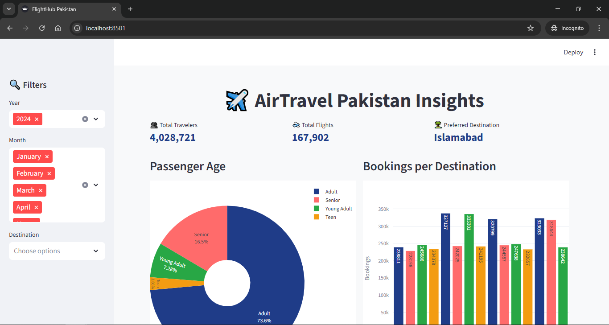
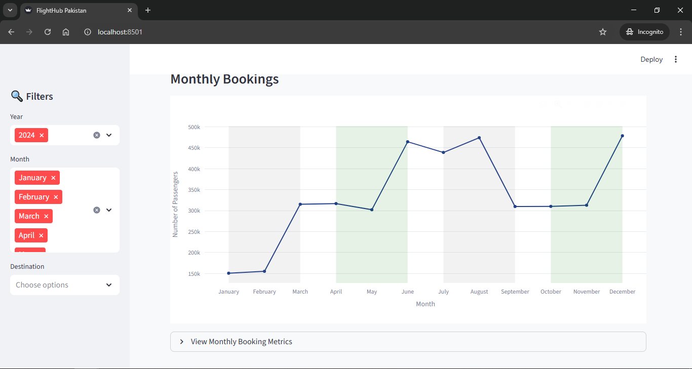
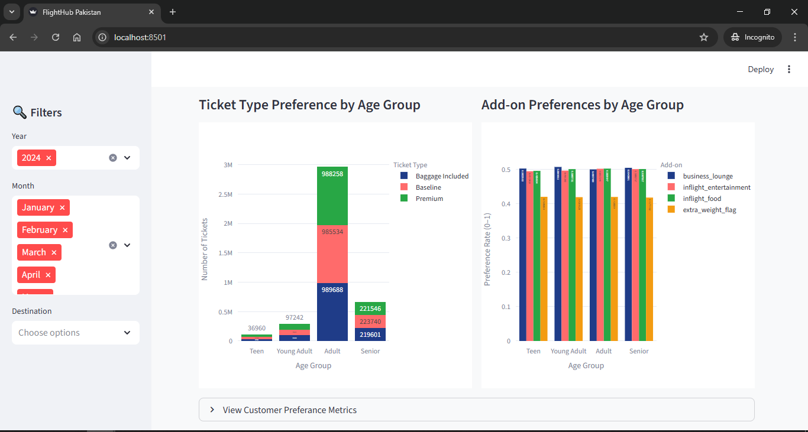
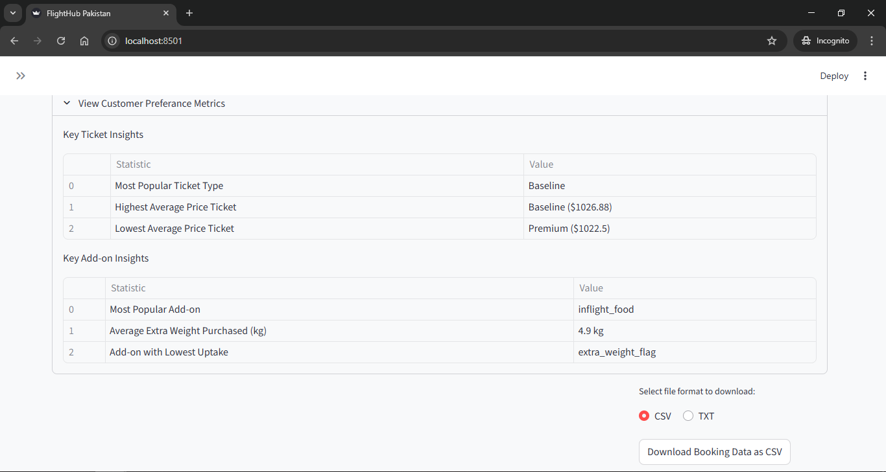

## Airline Bookings Dashboard using FlighHub Services

An interactive Streamlit dashboard for analyzing airline bookings and ratings.
This dashboard provides actionable insights for airlines and travel analysts by
visualizing KPIs, booking trends, and popular travel routes.

# Features
 - **Total Travelers:** Total number of booked passengers.
 - **Total Flights:** Total number of flights in the dataset.
 - **Preferred Destination:** The most popular destination based on bookings.
 - **Booking Growth:** Month-over-month growth in bookings.
 - **Top Routes:** Most frequent origin-destination pairs.
 - **Airline Ratings:** Ratings for airlines with sortable and filterable views.
 - **Interactive Filters:** Filter by month, airline, destination, or route.

# Screenshots - Dashboard overview

 KPIs & Top Routes:
 

 Monthly Bookings:
 

 Ticket Type Preference:
 

 Airline Ratings Table:
 

# Installation & Setup
 1. Clone the repository:
    git clone https://github.com/Alirockman1/airline_dashboard.git
    cd airline_dashboard

 2. Create `.env` file with Database credentials:
        DB_HOST=localhost
        DB_USER=root
        DB_PASSWORD=yourpassword
        DB_NAME=aviation_db

 3. Install dependencies:
    pip install -r requirements.txt

 4. Run the Streamlit app:
    streamlit run main.py

# Dependencies
 - Python 3.10+
 - Streamlit
 - pandas
 - matplotlib / plotly / altair (if used for charts)

# Code Overview
 - **app.py:** Main Streamlit app that displays the dashboard. Loads booking and airline data,
   calculates KPIs (total travelers, flights, preferred destination, booking growth),
   computes top routes, displays airline ratings, and adds interactive filters using
   Streamlit widgets (st.selectbox, st.multiselect, etc.). Layout structured with
   st.columns and st.expander for clean visualization.
 - src/: Contains helper scripts for data processing
    - **database.py:** Functions to load and query datasets
    - **merg.py:** Functions to merge booking and airline data
    - **utils.py:** Utility functions used across the dashboard
    - **wrangling.py:** Functions for cleaning and transforming data

# How to Use
 1. Use the sidebar to filter data by month, airline, or destination.
 2. Explore KPIs at a glance.
 3. Check the most popular routes and airlines.
 4. Analyze trends with charts and tables.

# Questions Answered
 Q: How to show top routes as metrics?
 - Combine origin and destination columns to create a route column.
 - Aggregate bookings by route and display the top N using st.metric inside st.columns.

 Q: How to calculate booking growth from booking_month?
 - Convert booking_month to datetime.
 - Filter for the latest month and previous month.
 - Sum bookings and calculate growth percentage:
   growth_pct = ((current_month_bookings - previous_month_bookings) / previous_month_bookings) * 100
 - Display with st.metric including delta for +/- growth.

 Q: How to take screenshots for GitHub?
 - Use OS shortcuts (Win+Shift+S, Cmd+Shift+4) or browser screenshot tools.
 - Crop to show dashboard only.
 - Save in images/ folder and reference in README.

## Repository Structure
# airline_dashboard/
# ├── save_folder/
# │   └── bookings.csv
# ├── images/
# │   ├── Figure1.png
# │   ├── Figure2.png
# │   ├── Figure3.png
# │   └── Figure4.png
# ├── src/
# │   ├── database.py
# │   ├── merg.py
# │   ├── utils.py
# │   └── wrangling.py
# ├── app.py
# ├── main.py
# ├── requirements.txt
# └── README.md
